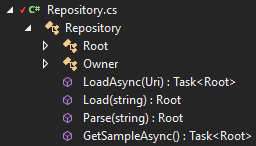

# TypeProviders.CSharp
[](https://ci.appveyor.com/project/JEgger/typeproviders-csharp)
[](https://www.nuget.org/packages/TypeProviders.CSharp.BuildTimeGeneration/)

Generate C# types out of untyped data.

## Supported formats
* JSON (thanks to [FSharp.Data](https://github.com/fsharp/FSharp.Data) for their awesome type provider)

## Sample usage
### Build-time/design-time generation (leverages [CodeGeneration.Roslyn](https://github.com/AArnott/CodeGeneration.Roslyn))
* Install the [NuGet package](https://www.nuget.org/packages/TypeProviders.CSharp.BuildTimeGeneration/) (`Install-Package TypeProviders.CSharp.BuildTimeGeneration`)
* Add a new C# file, name it Repository.cs and set the following content:

    ```
    using TypeProviders.CSharp.BuildTimeGeneration.Attributes;

    namespace Data
    {
        [JsonProvider("https://api.github.com/repos/eggapauli/typeproviders.csharp")]
        public partial class Repository
        {
        }
    }
    ```
      
* Enable code generation for Repository.cs either through Visual Studio or by manipulating the .csproj file directly:
  * In Visual Studio, select Repository.cs, go to the `Properties` window and set `Custom Tool` to `MSBuild:GenerateCodeFromAttributes`.
  * In the .csproj file, change
    
      `<Compile Include="Repository.cs"/>`
        
      to
        
      ```
      <Compile Include="Repository.cs">
        <Generator>MSBuild:GenerateCodeFromAttributes</Generator>
      </Compile>
      ```
* Run code generation either by building the project or by right-clicking on Repository.cs in Visual Studio and selecting `Run Custom Tool`
* Done. The following image shows the structure of the final Repository class.

  
  
### Design-time generation (implemented as Roslyn code refactoring)
Currently code refactorings can only be published as Visual Studio extensions. But unless the [Visual Studio marketplace](https://marketplace.visualstudio.com/) provides an API for publishing extensions I don't bother doing this.
